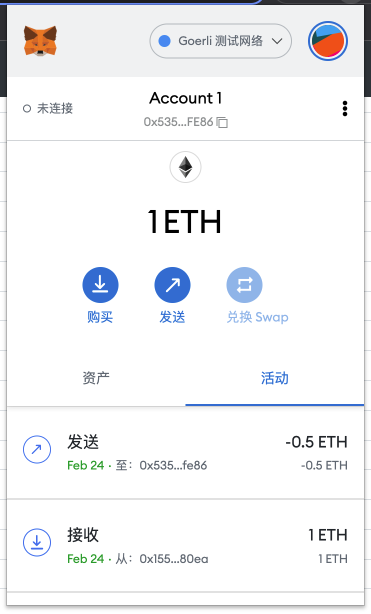
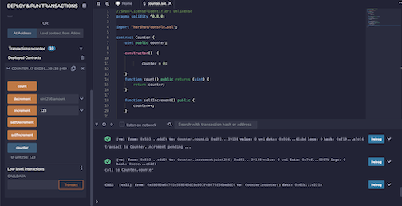
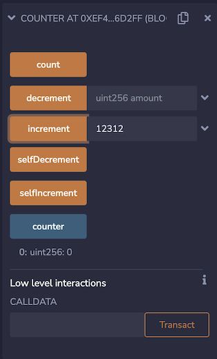
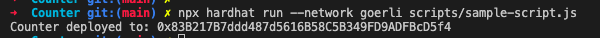

## 目标
- 安装 Metamask、并创建好账号
- 执行一次转账
- 使用 Remix 创建任意一个合约
- VSCode IDE 开发环境配置
- 使用 Truffle 部署 Counter 合约 到 test 网络（goerli）（提交交易 hash）
- 编写一个测试用例

1. 使用自己的 github 创建一个作业代码库
2. 每一次作业使用一个文件夹(w1) 

## 安装metamusk

## 完成转账
- tx: 0x5352f3169b6c737ec64c5bc8a68c4ffa81bafe86
- rx: 0x5352f3169b6c737ec64c5bc8a68c4ffa81bafe86
- value: 0.5Eth

explorer Link: 
https://goerli.etherscan.io/tx/0x3af16f80312b4e3452be860bb8f2a6f7f9b72d33f55de629463a84ebe2ae64a8

## Remix 创建合约以及部署

Deploy TX:
https://goerli.etherscan.io/tx/0x46ad6199caddcd5b0923080342ee6d14af7911ffa902cb63e6dce2e376d8b182

## 本地 创建合约以及部署
使用 本地 hardhat 环境来进行合约编译以及部署
使用脚本来进行部署

具体测试代码见 Counter 文件夹
- TX: https://goerli.etherscan.io/tx/0xf27e63adf17c324705815fa41203720791f4b73fdf1bfe7b840050002a21432f
- contract Address: 0x83b217b7ddd487d5616b58c5b349fd9adfbcd5f4