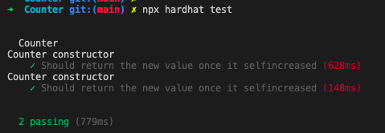

## 目标
* 使用Hardhat部署修改后的Counter
* 使用Hardhat测试Counter
* 写一个脚本调用count()

## Hardhat部署
使用 本地 hardhat 环境来进行合约编译以及部署
使用脚本来进行部署

- TX:https://goerli.etherscan.io/tx/0xf27e63adf17c324705815fa41203720791f4b73fdf1bfe7b840050002a21432f
- contract Address: 0x83b217b7ddd487d5616b58c5b349fd9adfbcd5f4
- 
## Hardhat测试
具体测试代码见 Counter/test 文件夹.

合约脚本调用 详情如下

